Présentation de l'application CrowderDispatcher
=================

Versions [PDF](./readme.pdf), [HTML](./readme.html)


Introduction
------------------

Le but de l'application est de permettre aux utilisateurs de faire une répartition des pivots par crowders afin d'avoir une distribution correcte et équilibré, elle permet aussi d'estimer le temps nécessaire pour le crowding.

- Pivots : une pair de question-réponse d'un FAQ

- Crowder : Personne qui aura pour tâche de donner un équivalent ou une notation à une question ou réponse d'un pivot

- Proposition : Une question/réponse équivalente à celle d'un pivot

- Notations : C'est une note en nombre d'étoiles donnée à une proposition afin d'évaluer la qualité de cette dernière. 


Liens :

- Dépôt git :  https://github.com/yassinefarich/civa-repartition
- Url public : https://talan-civa-repartition.netlify.app/


Sommaire
-----------------

   * [Présentation de l'application CrowderDispatcher](#présentation-de-lapplication-crowderdispatcher)
      * [Introduction](#introduction)
      * [Sommaire](#sommaire)
      * [I. Calcul](#i-calcul)
         * [1. Répartition des propositions](#1-répartition-des-propositions)
         * [2 Répartition des notations](#2-répartition-des-notations)
         * [3. Calcule du temps nécessaire au crowding](#3-calcule-du-temps-nécessaire-au-crowding)
      * [II. Présentation de l'application](#ii-présentation-de-lapplication)
         * [1. Paramètres](#1-paramètres)
         * [2. Données](#2-données)
         * [3. Répartitions](#3-répartitions)
         * [4. Gestion du temps](#4-gestion-du-temps)
      * [III. Présentation technique et dev](#iii-présentation-technique-et-dev)
         * [1. Outils](#1-outils)
         * [2. Build](#2-build)
         * [3. Configuration de l'appli sur <a href="https://app.netlify.com/" rel="nofollow">netlify</a>](#3-configuration-de-lappli-sur-netlify)


------

I. Calcules
---------------

 ### 1. Répartition des propositions
La répartition des questions/réponses est la tâche principale de l'application, elle consiste à dire pour chaque crowder quels sont les questions/réponses des pivots pour lesquels il doit donner une proposition.

Ce repartitionnement se fait de la manière ci-dessous

1. Calcule du nombre total des propositions

   ```bash
   Nombre de propositions = Nombre de pivots * Nombre de propositions par pivot * 2
   ```


2. Calcule du Nombre de question/réponse par crowder

   ```
   Nombre de question/réponse par crowder = Nombre total de propositions / Nombre de crowders
   ```
   
3. Répartition des questions/réponses par crowder

   La répartition des questions/réponses se fait en rotation, voir exemple ci-dessous

Exemple 

   ```bash
   # Paramétres
   Crowders : C1, C2, C3
   Pivots : P1(Q1/R1), P2(Q2/R2)
   Propositions par pivot : 3
   # Calcules
   Nombre de propositions = 3 * 2 * 2 => 12
   Nombre de question/réponse par crowder = 12 / 3 => 4 
   # Répartitions
   Questions/réponses total = Q1, R1, Q2, R2 (Q1 : Question 1, R1: Réponse 1)
   Répartition en rotation
       C1 : Q1, R1, Q2, R2
       C2 : Q1, R1, Q2, R2
       C3 : Q1, R1, Q2, R2
   ```


### 2 Répartition des notations

La répartition des notations consiste à définit pour chaque crowder les propositions pour lesquels il doit donner une notation.   
Cette répartition se fait de la même manière que celle des propositions en respectant les étapes ci-dessous 

1. Calcule du nombre total de notations
   ```bash
   Nombre de propositions = Nombre de pivots * Nombre de propositions par pivot * 2
   Nombre total de notations  = (Nombre de propositions + Nombre de pivots * 2 ) * Nombre de notation par proposition
   ```
   
2. Calcule du nombre des notations par crowder

   ```
   Nombre de notations par crowder = Nombre total de notations / nombre de crowders
   ```

3. Répartition des propositions par crowder

   La répartition des propositions se fait en rotation, voir exemple ci-dessous

Exemple 

   ```bash
   # Paramétres
   Crowders : C1, C2, C3
   Pivots : P1(Q1/R1), P2(Q2/R2)
   Propositions par pivot : 2
   Notations par propositions : 2
   # Calcules
   Nombre de propositions = 2 * 2 * 2 => 8
   Nombre total de notations = ( 8 + 2 * 2 ) * 2 => 24
   Nombre de notations par crowder = 24 / 3 => 8
   Propositions :  P1R, P1Q, P2R, P2Q, PRQ1, PRQ1, PRQ2, PRQ2, PRR1, PRR1, PRR2, PRR2
   (PRQ1 : Proposition de question pivot 1, PRR1 : Proposition de réponse pivot 1, P1R : Pivot 1 réponse, P1Q : Pivot 1 question)
   # Répartitions
   Questions/réponses total = Q1, R1, Q2, R2 
   Répartition en rotation
       C1 : P1R, P1Q, P2R, P2Q, PRQ1, PRQ1, PRQ2, PRQ2
       C2 : PRR1, PRR1, PRR2, PRR2, P1R, P1Q, P2R, P2Q
       C3 : PRQ1, PRQ1, PRQ2, PRQ2, PRR1, PRR1, PRR2, PRR2
   ```

### 3. Calcule du temps nécessaire au crowding
Cette fonctionnalité permet d'avoir une estimation du temps nécessaire pour chaque étape du crowding, les calcules se font de la manière ci-dessous :

1. Calcule du temps total de propositions 

   ```bash
   Temps nécessaire pour propositions de questions = nombre total de pivots * nombre de propositions par pivot * temps de proposition de question
   
   Temps nécessaire pour propositions de réponses = nombre total de pivots * nombre de propositions par pivot * temps de proposition de réponse
   ```

   ```bash
   Temps total nécessaire pour propositions = Temps nécessaire pour propositions de questions + Temps nécessaire pour propositions de réponses
   
   Temps total nécessaire pour propositions pour tous les crowder = Temps total nécessaire pour propositions pour un seul crowder / nombre de crowders
   ```


Exemple :

```bash
# Paramétres
Nombre de pivots = 3
Nombre de crowder = 3
Propositions par pivot : 2
Temps de proposition de question = 0.02 h
Temps de proposition de réponse = 0.01 h
----------------------------
Temps nécessaire pour propositions de questions = 3 * 2 * 0.02 => 0.12 h
Temps nécessaire pour propositions de réponse = 3 * 2 * 0.01 => 0.06 h
Temps total nécessaire pour propositions = 0.12 + 0.06 => 0.18 h
Temps total nécessaire pour propositions pour tous les crowder = 0.18 / 3 => 0.06 h
```

2. Calcule de temps total de notations

```
Temps nécessaire pour notation de questions = ( nombre total de notations de question + nombre de pivots ) * temps de notation de question

Temps nécessaire pour notation de réponse = ( nombre total de notations de réponses + nombre de pivots ) * temps de notation de réponse

Temps total de notations = temps nécessaire pour notation de questions + temps nécessaire pour notation de réponse 

Temps total de notations pour tous les crowders = Temps total de notations / nombre de crowders
```

Exemple :

```bash
# Paramétres
Nombre total de notations de questions = 20
Nombre total de notations de réponses = 20
Nombre de pivots = 4
Nombre de crowder = 3
Temps de notation de question = 0.02 h
Temps de notation de réponse = 0.01 h
------------------------------------------------
Temps nécessaire pour notation de questions = ( 20 + 4 ) * 0.02 => 0.48h
Temps nécessaire pour notation de réponses = ( 20 + 4 ) * 0.02 => 0.24h
Temps total de notations = 0.48 + 0.24 => 072 h
Temps nécessaire pour notation de questions = 0.72 / 3 => 0.24h
```


II. Présentation de l'application
-----------------------------------

### 1. Paramètres 
La section paramètres permet à l'utilisateur de définir les paramètres pour la répartition et la gestion du temps

- Paramètres de répartitions :


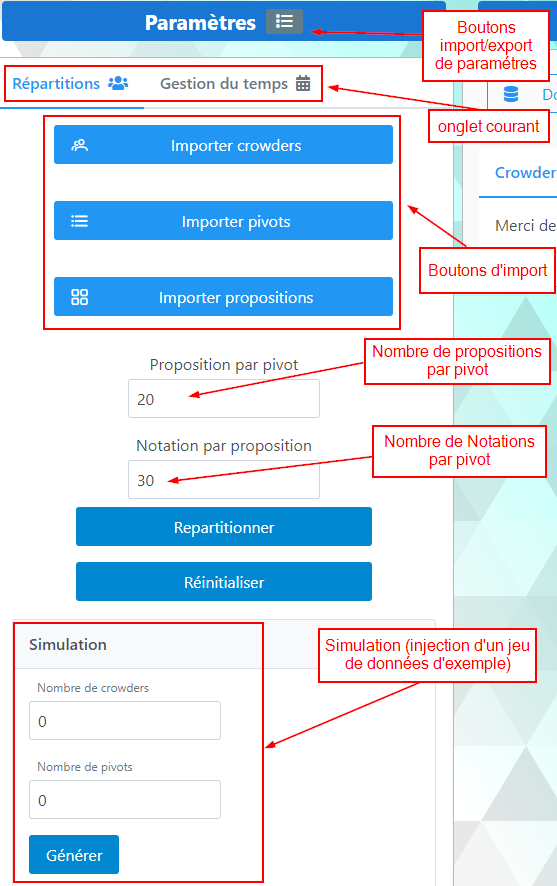

Les boutons d'import (crowders/pivots/propositions)  : permet d’importer une liste Excel de crowders, pivots ou propositions

Exemple de fichiers : 

````
- Crowders : https://github.com/yassinefarich/civa-repartition/blob/master/examples/CIVA_CROWDERS.xlsx
- Pivots : https://github.com/yassinefarich/civa-repartition/blob/master/examples/CIVA_QUESTIONS_PILOTE.xlsx
- Propositions : https://github.com/yassinefarich/civa-repartition/blob/master/examples/CIVA_REPONSES_PILOTE.xlsx
````

- Paramètres de gestion du temps :


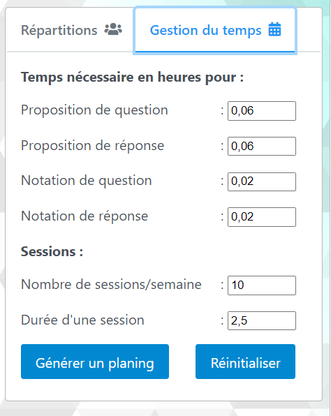

- Import export des paramètres :


Cette fonctionnalité permet l'import/export des paramètres en fichier au format JSON

exemple de fichier JSON d'import/export : 

```json
{
  "nombreDeCrowders": 0,
  "nombreDePivots": 0,
  "nombreDePropositionsParPivot": 20,
  "nombreDeNotationsParProposition": 30,
  "tempsDePropositonDeQuest": 0.06,
  "tempsDePropositonDeRep": 0.06,
  "tempsDeNotationDeQue": 0.02,
  "tempsDeNotationDeRep": 0.02,
  "nbrDeSessionsParSemaine": 10,
  "dureeDeSession": 2.5
}
```

### 2. Données 

La section données permet l'affichage des données chargées (liste de crowders/pivots et propositions)

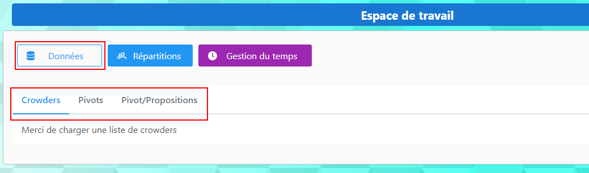

Cette section contienne trois onglets :

- Crowders : Liste des crowders chargées

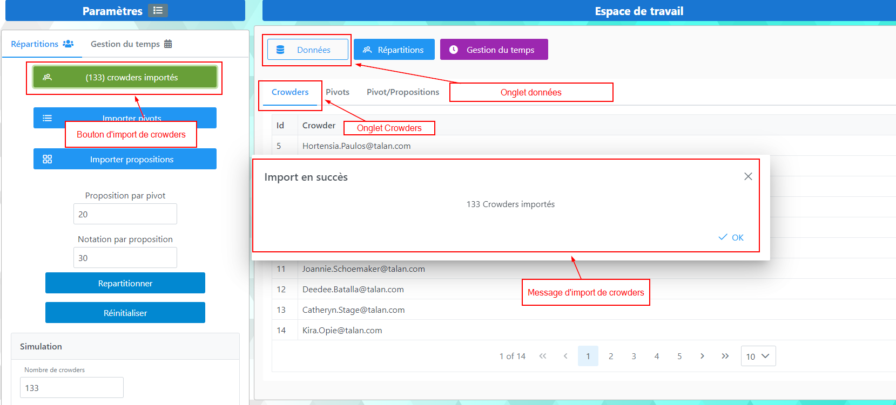

- Pivots : Liste des pivots chargées

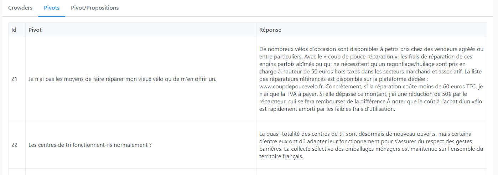

- Propositions : Liste des propositions chargées

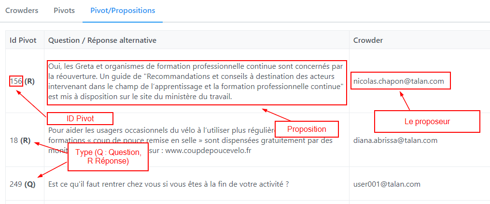

### 3. Répartitions

Après avoir cliquer sur le bouton `Repartitionner` dans la section paramètres, une distributions de question/réponses de pivots par crowders est effectué.

- Crowders de propositions : cet onglet présente pour chaque crowder la liste des pivots pour lequel il doit donner une proposition alternative   

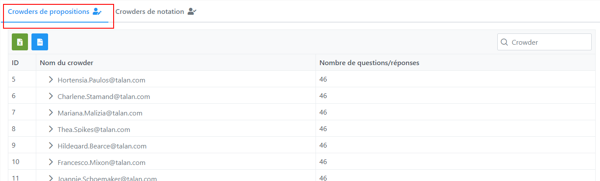

Après avoir choisir un crowder la liste des question/réponses apparait en dessous 

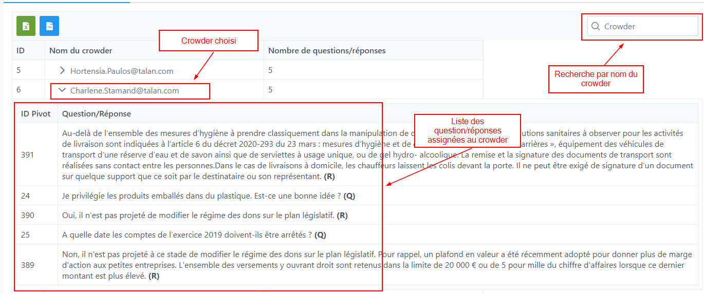

L'export  du résultat en CSV ou Excel est comme ci-dessous  

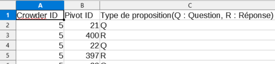

- Crowders de notation : cet onglet présente pour chaque crowder la liste des propositions pour lequel il doit donner une notation

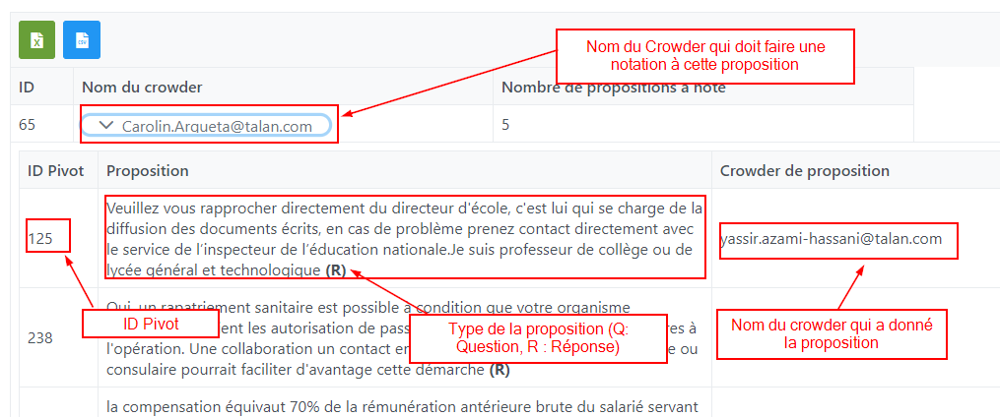

L'export  du résultat en CSV ou Excel est comme ci-dessous  


### 4. Gestion du temps

Cette section permette d'afficher l'estimation du temps nécessaire pour effectuer le crowding.

Après avoir cliquer sur le bouton `Générer un planning` dans la section paramètres écran ci-dessous est affiché 

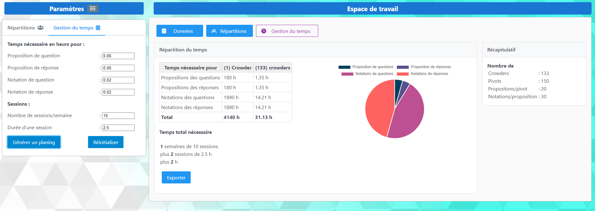


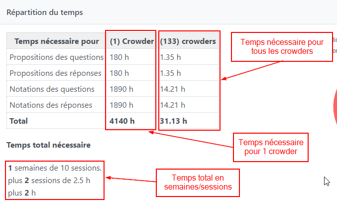

III. Présentation technique et dev
----------------------------------

### 1. Outils

Les principaux outils utilisé dans le dev sont comme dessous :

- angular 10 : Framework javascript, https://angular.io/
- primeng 10 : Biblithéque UI javascript, https://primefaces.org/primeng/
- sheetjs : Permet la lecture des fichier xslx, https://github.com/SheetJS/sheetjs
- npm : outil de build, voir https://www.npmjs.com/

L'application actuel n'a pas de backend, tout les données sont stockées dans le [LocalStorage](https://fr.wikipedia.org/wiki/Stockage_web_local) du navigateur WEB 

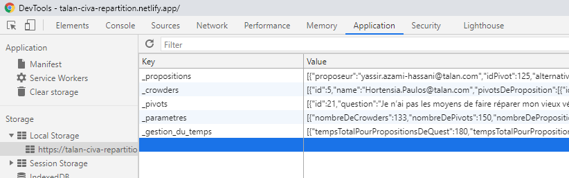


### 2. Build

Afin de builder le projet c'est recommandé de suivre les étapes ci-dessous :

```sh
# 0. Intaller NodeJS, voir url (https://nodejs.org/en/download/)
# 1. Cloner le repo git
git clone https://github.com/yassinefarich/civa-repartition.git
# 2. Installer les dépendences
cd civa-repartition
npm install
# 3. Pour lancer l'appli en mode dev (url : http://localhost:4200/)
npm start
# 4. Pour builder en mode prod
npm run build-prod
```

Pour déployer l'appli il suffit de déployer le contenu du dossier `dist/` généré suite au build prod

### 3. Configuration de l'appli sur [netlify](https://app.netlify.com/)

Ci-dessous la configuration utilisé actuellement pour déployer l'appli sur le service [netlify](https://app.netlify.com/) 

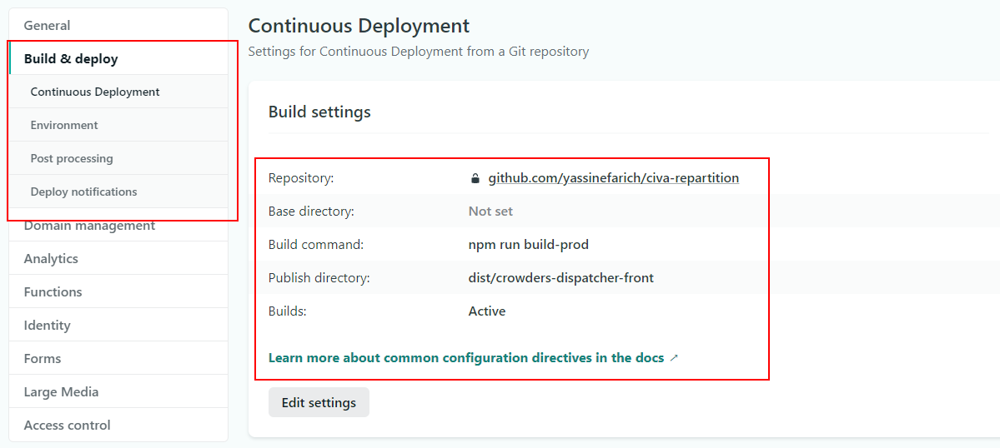

```

```
