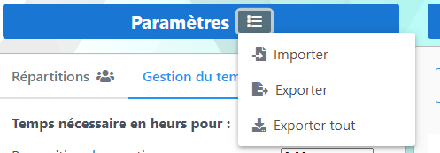
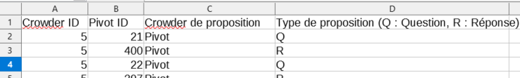
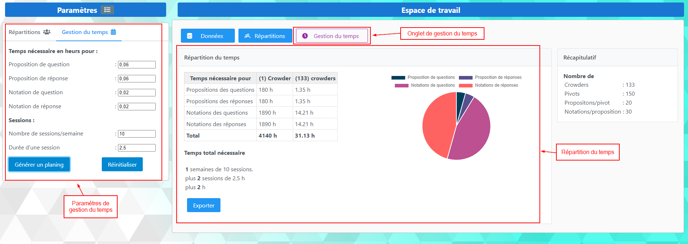

# Présentation de l'application CrowderDispatcher


[TOC]


## Introduction

Le but de l'application est de permettre à l'utilisateur de faire une répartition des questions/réponses des pivots* par crowder** afin d'avoir une distribution correcte et équilibré, elle permet aussi d'estimer le temps nécessaire pour le crowding.

*Pivots : Pair (question, réponse)
**Crowder : Personne qui aura pour tâche de donner ou à noter un équivalent à une question ou réponse d'un pivot
    

## I. Calcules

 ### Répartition des propositions/notations 
Le repartitionnement des question/réponses des pivot se fait de la manière ci-dessous **A Compléter....**

1.   Calcule du nombre total des propositions


2. Distribution de ces propositions par nombre de crowders


### Gestion du temps
Le calcule du temps nécessaire se fait de la manière ci-dessous **A Compléter....**


## II. Présentation de l'application
### 1. Paramètres 
La section paramètres permet à l'utilisateur de définir les paramètres pour la répartition et la gestion du temps

- Paramètres de répartitions :


Les boutons d'import (crowders/pivots/propositions)  : permet d’importer une liste Excel de crowders, pivots ou propositions

Exemple de fichiers : [crowders.xlsx](./exemples/CRODERS.XLSX), [pivots.xlsx](./exemples/PIVOTS.xlsx) ou [propositions.xlsx](./exemples/PROPOSITIONS.XLSX) 

- Paramètres de gestion du temps :


- Import export des paramètres :





Cette fonctionnalité permet l'import/export des paramètres en fichier au format JSON

exemple de fichier JSON d'import/export : 

```json
{
  "nombreDeCrowders": 0,
  "nombreDePivots": 0,
  "nombreDePropositionsParPivot": 20,
  "nombreDeNotationsParProposition": 30,
  "tempsDePropositonDeQuest": 0.06,
  "tempsDePropositonDeRep": 0.06,
  "tempsDeNotationDeQue": 0.02,
  "tempsDeNotationDeRep": 0.02,
  "nbrDeSessionsParSemaine": 10,
  "dureeDeSession": 2.5
}
```

### 2. Données 

La section données permet l'affichage des données chargées (liste de crowders/pivots et propositions)


Cette section contienne trois onglets :

- Crowders : Liste des crowders chargées


- Pivots : Liste des pivots chargées


- Propositions : Liste des propositions chargées


### 3. Répartitions

Après avoir cliquer sur le bouton `Repartitionner` dans la section paramètres, une distributions de question/réponses de pivots par crowders est effectué.

- Crowders de propositions : cet onglet présente pour chaque crowder la liste des pivots pour lequel il doit donner une proposition alternative   


L'export  du résultat en CSV ou Excel est comme ci-dessous  


- Crowders de notation : cet onglet présente pour chaque crowder la liste des propositions pour lequel il doit donner une notation


L'export  du résultat en CSV ou Excel est comme ci-dessous  




### 4. Gestion du temps

Cette section permette d'afficher l'estimation du temps nécessaire pour effectuer le crowding.

Après avoir cliquer sur le bouton `Générer un planning` dans la section paramètres écran ci-dessous est affiché 




## III. Présentation technique et dev

### 1. Outils

Les principaux outils utilisé dans le dev sont comme dessous :

- angular 10 : Framework javascript, https://angular.io/
- primeng 10 : Biblithéque UI javascript, https://primefaces.org/primeng/
- sheetjs : Permet la lecture des fichier xslx, https://github.com/SheetJS/sheetjs
- npm : outil de build, voir https://www.npmjs.com/

L'application actuel n'a pas de backend, tout les données sont stockées dans le [LocalStorage](https://fr.wikipedia.org/wiki/Stockage_web_local) du navigateur WEB 


### 2. Build

Afin de builder le projet c'est recommandé de suivre les étapes ci-dessous :

```sh
# 1. Cloner le repo git
git clone https://github.com/yassinefarich/civa-repartition.git
# 2. Installer les dépendences
cd civa-repartition
npm install
# 3. Pour lancer l'appli en mode dev (url : http://localhost:4200/)
npm start
# 4. Pour builder en mode prod
npm run build-prod
```

Pour déployer l'appli il suffit de déployer le contenu du dossier `dist/` généré suite au build prod

### 3. Configuration de l'appli sur [netlify](https://app.netlify.com/)

Ci-dessous la configuration utilisé actuellement pour déployer l'appli sur le service [netlify](https://app.netlify.com/) 

